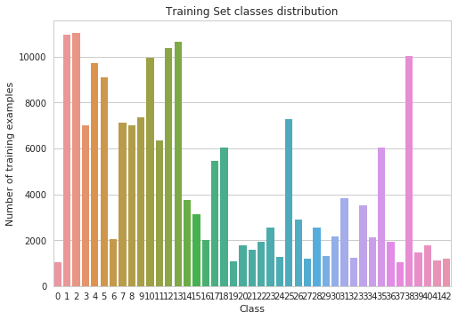

# Self-Driving Car Engineer Nanodegree

## Deep Learning

## Project: Build a Traffic Sign Recognition Classifier

In this notebook, a template is provided for you to implement your functionality in stages, which is required to successfully complete this project. If additional code is required that cannot be included in the notebook, be sure that the Python code is successfully imported and included in your submission if necessary. 

> **Note**: Once you have completed all of the code implementations, you need to finalize your work by exporting the iPython Notebook as an HTML document. Before exporting the notebook to html, all of the code cells need to have been run so that reviewers can see the final implementation and output. You can then export the notebook by using the menu above and navigating to  \n",
    "**File -> Download as -> HTML (.html)**. Include the finished document along with this notebook as your submission. 

In addition to implementing code, there is a writeup to complete. The writeup should be completed in a separate file, which can be either a markdown file or a pdf document. There is a [write up template](https://github.com/udacity/CarND-Traffic-Sign-Classifier-Project/blob/master/writeup_template.md) that can be used to guide the writing process. Completing the code template and writeup template will cover all of the [rubric points](https://review.udacity.com/#!/rubrics/481/view) for this project.

The [rubric](https://review.udacity.com/#!/rubrics/481/view) contains "Stand Out Suggestions" for enhancing the project beyond the minimum requirements. The stand out suggestions are optional. If you decide to pursue the "stand out suggestions", you can include the code in this Ipython notebook and also discuss the results in the writeup file.


>**Note:** Code and Markdown cells can be executed using the **Shift + Enter** keyboard shortcut. In addition, Markdown cells can be edited by typically double-clicking the cell to enter edit mode.


```python
## Setup environment and import of essential packages
# Tensorflow, Panda & NumPy are mandatory packages

import tensorflow as tf
import pandas as pd
import numpy as np
import random
import itertools

# Import and load data along with random selection package dependencies
import pickle
%matplotlib inline
import matplotlib.pyplot as plt
from sklearn.metrics import confusion_matrix

# Common utilities for miscellenous purposes & output format
import time
from datetime import timedelta
import math
import os
import seaborn as sns
sns.set_style("whitegrid")

# import cv2
```

---
## Step 0: Load The Data


```python
# Read file and load pickled data for training/validation/testing 

training_file = "train.p"
testing_file = "test.p"

with open(training_file, mode='rb') as f:
    train = pickle.load(f)
with open(testing_file, mode='rb') as f:
    test = pickle.load(f)
    
X_train, y_train = train['features'], train['labels']
X_test, y_test = test['features'], test['labels']
```

---

## Step 1: Dataset Summary & Exploration

The pickled data is a dictionary with 4 key/value pairs:

- `'features'` is a 4D array containing raw pixel data of the traffic sign images, (num examples, width, height, channels).
- `'labels'` is a 1D array containing the label/class id of the traffic sign. The file `signnames.csv` contains id -> name mappings for each id.
- `'sizes'` is a list containing tuples, (width, height) representing the original width and height the image.
- `'coords'` is a list containing tuples, (x1, y1, x2, y2) representing coordinates of a bounding box around the sign in the image. **THESE COORDINATES ASSUME THE ORIGINAL IMAGE. THE PICKLED DATA CONTAINS RESIZED VERSIONS (32 by 32) OF THESE IMAGES**

Complete the basic data summary below. Use python, numpy and/or pandas methods to calculate the data summary rather than hard coding the results. For example, the [pandas shape method](http://pandas.pydata.org/pandas-docs/stable/generated/pandas.DataFrame.shape.html) might be useful for calculating some of the summary results. 

### Provide a Basic Summary of the Data Set Using Python, Numpy and/or Pandas


```python
### Data loading and distribution for testing, validation and training
### % of data used for testing
TEST_SET = .18  

from sklearn.model_selection import train_test_split
X_train, X_validation, y_train, y_validation = train_test_split(X_train, y_train, test_size=TEST_SET, random_state=0)
print("Updated Image Shape: {}".format(X_train[0].shape))
```

    Updated Image Shape: (32, 32, 3)


```python
### Replace each question mark with the appropriate value. 
### Use python, pandas or numpy methods rather than hard coding the results

# TODO: Number of training examples
n_train = X_train.size
n_train1 = len(X_train)

# TODO: Number of validation examples
n_validation = X_validation.size
n_validation1 = len(X_validation)

# TODO: Number of testing examples.
n_test = .2*n_train

# TODO: What's the shape of an traffic sign image?
image_shape = X_train[0].shape

# TODO: How many unique classes/labels there are in the dataset.
n_classes = len(np.unique(y_train))

print("Number of training examples =", n_train)
print("Number of validation examples =", n_validation)
print("Number of testing examples =", n_test)
print("Image data shape =", image_shape)
print("Number of classes =", n_classes)

print("Number of training examples =", n_train1)
print("Number of validation examples =", n_validation1)
```

    Number of training examples = 98767872
    Number of validation examples = 21682176
    Number of testing examples = 19753574.400000002
    Image data shape = (32, 32, 3)
    Number of classes = 43
    Number of training examples = 32151
    Number of validation examples = 7058


### Include an exploratory visualization of the dataset

Visualize the German Traffic Signs Dataset using the pickled file(s). This is open ended, suggestions include: plotting traffic sign images, plotting the count of each sign, etc. 

The [Matplotlib](http://matplotlib.org/) [examples](http://matplotlib.org/examples/index.html) and [gallery](http://matplotlib.org/gallery.html) pages are a great resource for doing visualizations in Python.

**NOTE:** It's recommended you start with something simple first. If you wish to do more, come back to it after you've completed the rest of the sections. It can be interesting to look at the distribution of classes in the training, validation and test set. Is the distribution the same? Are there more examples of some classes than others?


```python
### Data exploration visualization code goes here.

# A single image reading and display
index=random.randint(0, len(X_train))
image =X_train[index].squeeze()
plt.figure(figsize=(1,1))
plt.imshow(image)

print(y_train[index])
```

    35


    /home/carnd/anaconda3/envs/carnd-term1/lib/python3.5/site-packages/matplotlib/font_manager.py:1297: UserWarning: findfont: Font family ['sans-serif'] not found. Falling back to DejaVu Sans
      (prop.get_family(), self.defaultFamily[fontext]))


```python
### Plot number of examples - summary and graph
# Load sign name, prepare data frame and plot 

signnames = pd.read_csv("signnames.csv")   # load signs

traindata = pd.DataFrame(y_train, columns=["ClassId"])    # Prepare train data
traindata = traindata.merge(signnames, how="left", left_on="ClassId", right_on="ClassId")
traindata = traindata.rename(columns={'ClassId': 'TrainFrequency'})

testdata = pd.DataFrame(y_test, columns=["ClassId"])   # Build data for testing
testdata = testdata.merge(signnames, how="left", left_on="ClassId", right_on="ClassId")
testdata["TestFrequency"] = 1

datacount = traindata.groupby(["SignName"]).count()  # Groupby for Test summary
datacount = datacount.join(testdata.groupby(["SignName"])["TestFrequency"].count())
datacount = datacount.sort_values(by="TrainFrequency", ascending=False)


datacount.plot.bar(figsize=(14, 7), color=['b','r'], width=.6, alpha=0.6) # plot it
plt.show()
```

    /home/carnd/anaconda3/envs/carnd-term1/lib/python3.5/site-packages/matplotlib/font_manager.py:1297: UserWarning: findfont: Font family ['sans-serif'] not found. Falling back to DejaVu Sans
      (prop.get_family(), self.defaultFamily[fontext]))


```python
### PLOT SIGN IMAGES FUNCTION Function used to plot M images in a grid of NxN

import matplotlib.gridspec as gridspec

GRID_WIDTH = 4     # Number of signs in a row
GRID_HEIGHT = 8    # Number of rows to Diaplay

def plot_images(start_idx, end_idx):
    gs = gridspec.GridSpec(GRID_HEIGHT, GRID_WIDTH, top=1., bottom=-0.3, right=2., left=0., hspace=0.3, wspace=0.2)
    
    i = 0
    
    # Get indexes of each example from each class
    for sign_type in datacount[start_idx:end_idx].index:
        idxs = traindata[traindata["SignName"] == sign_type].index.tolist()
        ax = plt.subplot(gs[i])
        ax.imshow(X_train[idxs[100]])
        ax.set_xticks([])
        ax.set_yticks([])
        ax.set_title(sign_type)
        
        i+=1
```


```python
### Plot Images - This is in sequence 
# Function could be randomize for a set of Signs

M =  0    # Start Image Index
N = 32    # End image Index

plot_images(M,N)
```

    /home/carnd/anaconda3/envs/carnd-term1/lib/python3.5/site-packages/matplotlib/font_manager.py:1297: UserWarning: findfont: Font family ['sans-serif'] not found. Falling back to DejaVu Sans
      (prop.get_family(), self.defaultFamily[fontext]))


```python
# Plot next set of Signs

# M = 62    # Start Image Index
# N = 94    # End image Index

plot_images(33, 64)
```

    /home/carnd/anaconda3/envs/carnd-term1/lib/python3.5/site-packages/matplotlib/font_manager.py:1297: UserWarning: findfont: Font family ['sans-serif'] not found. Falling back to DejaVu Sans
      (prop.get_family(), self.defaultFamily[fontext]))


----

## Step 2: Design and Test a Model Architecture

Design and implement a deep learning model that learns to recognize traffic signs. Train and test your model on the [German Traffic Sign Dataset](http://benchmark.ini.rub.de/?section=gtsrb&subsection=dataset).

The LeNet-5 implementation shown in the [classroom](https://classroom.udacity.com/nanodegrees/nd013/parts/fbf77062-5703-404e-b60c-95b78b2f3f9e/modules/6df7ae49-c61c-4bb2-a23e-6527e69209ec/lessons/601ae704-1035-4287-8b11-e2c2716217ad/concepts/d4aca031-508f-4e0b-b493-e7b706120f81) at the end of the CNN lesson is a solid starting point. You'll have to change the number of classes and possibly the preprocessing, but aside from that it's plug and play! 

With the LeNet-5 solution from the lecture, you should expect a validation set accuracy of about 0.89. To meet specifications, the validation set accuracy will need to be at least 0.93. It is possible to get an even higher accuracy, but 0.93 is the minimum for a successful project submission. 

There are various aspects to consider when thinking about this problem:

- Neural network architecture (is the network over or underfitting?)
- Play around preprocessing techniques (normalization, rgb to grayscale, etc)
- Number of examples per label (some have more than others).
- Generate fake data.

Here is an example of a [published baseline model on this problem](http://yann.lecun.com/exdb/publis/pdf/sermanet-ijcnn-11.pdf). It's not required to be familiar with the approach used in the paper but, it's good practice to try to read papers like these.

### Pre-process the Data Set (normalization, grayscale, etc.)

Minimally, the image data should be normalized so that the data has mean zero and equal variance. For image data, `(pixel - 128)/ 128` is a quick way to approximately normalize the data and can be used in this project. 

Other pre-processing steps are optional. You can try different techniques to see if it improves performance. 

Use the code cell (or multiple code cells, if necessary) to implement the first step of your project.


```python
### Preprocess the data here. It is required to normalize the data. Other preprocessing steps could include 
### converting to grayscale, etc.
### Feel free to use as many code cells as needed.

from sklearn.utils import shuffle
X_train, y_train = shuffle(X_train, y_train)
```


```python
## Pre processing data Steps for randomized approaches !!
```


```python
##### Pre Process Data and Clean It ####

from sklearn.utils import shuffle
import scipy
from scipy import linalg
import scipy.ndimage as ndi
from skimage import transform, exposure
from skimage.util import random_noise
import skimage
```


```python
### Pre Process Steps

def transform_matrix_offset_center(matrix, x, y):
    o_x = float(x) / 2 + 0.5
    o_y = float(y) / 2 + 0.5
    offset_matrix = np.array([[1, 0, o_x], [0, 1, o_y], [0, 0, 1]])
    reset_matrix = np.array([[1, 0, -o_x], [0, 1, -o_y], [0, 0, 1]])
    transform_matrix = np.dot(np.dot(offset_matrix, matrix), reset_matrix)
    return transform_matrix

def apply_transform(x, transform_matrix, channel_index=2, fill_mode='nearest', cval=0.):
    x = np.rollaxis(x, channel_index, 0)
    final_affine_matrix = transform_matrix[:2, :2]
    final_offset = transform_matrix[:2, 2]
    channel_images = [ndi.interpolation.affine_transform(x_channel, final_affine_matrix,
                      final_offset, order=0, mode=fill_mode, cval=cval) for x_channel in x]
    x = np.stack(channel_images, axis=0)
    x = np.rollaxis(x, 0, channel_index+1)
    return x

def shear(x, intensity=0.3, is_random=False, row_index=0, col_index=1, channel_index=2, fill_mode='nearest', cval=0.):
    if is_random:
        shear = np.random.uniform(-intensity, intensity)
    else:
        shear = intensity
    shear_matrix = np.array([[1, -np.sin(shear), 0],
                             [0, np.cos(shear), 0],
                             [0, 0, 1]])

    h, w = x[0].shape[row_index], x[0].shape[col_index]
    transform_matrix = transform_matrix_offset_center(shear_matrix, h, w)
    results = []
    for data in x:
        results.append( apply_transform(data, transform_matrix, channel_index, fill_mode, cval))
    return np.asarray(results)

def shift(x, wrg=0.2, hrg=0.2, is_random=False, row_index=0, col_index=1, channel_index=2,
                 fill_mode='nearest', cval=0.):
    h, w = x[0].shape[row_index], x[0].shape[col_index]
    if is_random:
        tx = np.random.uniform(-hrg, hrg) * h
        ty = np.random.uniform(-wrg, wrg) * w
    else:
        tx, ty = hrg * h, wrg * w
    translation_matrix = np.array([[1, 0, tx],
                                   [0, 1, ty],
                                   [0, 0, 1]])

    transform_matrix = translation_matrix  # no need to do offset
    results = []
    for data in x:
        results.append( apply_transform(data, transform_matrix, channel_index, fill_mode, cval))
    return np.asarray(results)

def rotation(x, rg=10, is_random=False, row_index=0, col_index=1, channel_index=2,
                    fill_mode='nearest', cval=0.):
    if is_random:
        theta = np.pi / 180 * np.random.uniform(-rg, rg)
    else:
        theta = np.pi /180 * rg
    rotation_matrix = np.array([[np.cos(theta), -np.sin(theta), 0],
                                [np.sin(theta), np.cos(theta), 0],
                                [0, 0, 1]])

    h, w = x[0].shape[row_index], x[0].shape[col_index]
    transform_matrix = transform_matrix_offset_center(rotation_matrix, h, w)
    results = []
    for data in x:
        results.append( apply_transform(data, transform_matrix, channel_index, fill_mode, cval))
    return np.asarray(results)

def multitransform(x):
    x=rotation(x, is_random=True)
    x=shift(x, is_random=True)
    x=shear(x, is_random=True)
    return x

def randomly_distort(x,y):
    for i in range(43):
        print(i)
        indexes = y == i
        #count = np.sum(indexes)
        
        ex = 5                               #int(2200/count)
        x_train_sample = x[indexes]
        y_train_sample = y[indexes]
        x_extra = []
        y_extra = []
        
        for i in range(ex):
            x_extra = multitransform(x_train_sample)
            x = np.concatenate((x, x_extra))
            y = np.concatenate((y, y_train_sample))
    return x,y
```


```python
#### Randomly Distort training set of Data 

X_train, y_train = randomly_distort(X_train, y_train)
```

    0
    1
    2
    3
    4
    5
    6
    7
    8
    9
    10
    11
    12
    13
    14
    15
    16
    17
    18
    19
    20
    21
    22
    23
    24
    25
    26
    27
    28
    29
    30
    31
    32
    33
    34
    35
    36
    37
    38
    39
    40
    41
    42


```python
# Training set size after Image Augmentation
print(X_train.shape, y_train.shape)
```

    (192906, 32, 32, 3) (192906,)


```python
# Plot the number of examples of each sign in the training set after Image augmentation
sns.countplot(y_train)
plt.ylabel('Number of training examples')
plt.xlabel('Class')
plt.title('Training Set classes distribution')
plt.show()
```

    /home/carnd/anaconda3/envs/carnd-term1/lib/python3.5/site-packages/matplotlib/font_manager.py:1297: UserWarning: findfont: Font family ['sans-serif'] not found. Falling back to DejaVu Sans
      (prop.get_family(), self.defaultFamily[fontext]))





```python
# Compute the max and min observations

dist = np.histogram(y_train, bins=n_classes)
classes = dist[1]
counts = dist[0]
max_count = max(counts)
min_count = min(counts)

print("Max observations for a class:", max_count)
print("Min observations for a class:", min_count)
```

    Max observations for a class: 11034
    Min observations for a class: 1020


```python
## Show the above samples with preprocessing applied
plt.imshow(X_train[n_train1],  interpolation = 'spline16')
plt.show()
```

    /home/carnd/anaconda3/envs/carnd-term1/lib/python3.5/site-packages/matplotlib/font_manager.py:1297: UserWarning: findfont: Font family ['sans-serif'] not found. Falling back to DejaVu Sans
      (prop.get_family(), self.defaultFamily[fontext]))


import cv2

from sklearn.preprocessing import scale

def preprocess(image):
    image=cv2.convertScaleAbs(image)

    # Convert to LAB colorspace
    lab = cv2.cvtColor(image, cv2.COLOR_BGR2LAB)
    l, a, b = cv2.split(lab)
    clahe = cv2.createCLAHE(clipLimit=3.0, tileGridSize=(8,8))
    cl = clahe.apply(l)
    
    limg = cv2.merge((cl,a,b))
    
    final = cv2.cvtColor(limg, cv2.COLOR_LAB2BGR)
    final=final/final.max()
    
    return final

ft=preprocess(X_train[n_train1])
plt.figure()

plt.imshow(ft)
print(ft)

print("Preprocessing done.")
# NOTE-1 : AWS COMMUNITY image provided by UDACITY seems to have a specific concern, which is related to CV2 environment. CV2 expects an access of a *.SO file which is not available or permitted.

# NOTE-2 : I have tried to remove dependency for environment by installing extra packages however system didn't allow to intall or upgrade AWS Image

# NOTE-3 : BGR normalization concept i have learned from earlier alumani of Udacity, there work helped in accessing CV2 function however CV2 enviroment giving following error. Also i have commented code piece and drop the idea of leveraging normalization at this moment. 

ERROR SNAP (for CV2 dependency):
-----------------------------------------------------------------------------------------------
ImportError                               Traceback (most recent call last)
<ipython-input-22-92a40e2202e0> in <module>()
----> 1 import cv2
      2 
      3 from sklearn.preprocessing import scale
      4 
      5 def preprocess(image):

ImportError: libgtk-x11-2.0.so.0: cannot open shared object file: No such file or directory
-------------------------------------------------------------------------------------------------
### Model Architecture


```python
### Setup tensor flow 
### The EPOCH and BATCH_SIZE values affect the training speed and model accuracy.

import tensorflow as tf

EPOCHS = 22
BATCH_SIZE = 115
```


```python
### Define your architecture here.
### Feel free to use as many code cells as needed.

from tensorflow.contrib.layers import flatten

def TrafficSign_Net(x):    
    # Arguments used for tf.truncated_normal, randomly defines variables for the weights and biases for each layer
    mu = 0
    sigma = 0.012
    
    # SOLUTION: Layer 1: Convolutional. Input = 32x32x3. Output = 28x28x6.
    conv1_W = tf.Variable(tf.truncated_normal(shape=(5, 5, 3, 6), mean = mu, stddev = sigma))
    conv1_b = tf.Variable(tf.zeros(6))
    conv1   = tf.nn.conv2d(x, conv1_W, strides=[1, 1, 1, 1], padding='VALID') + conv1_b

    # SOLUTION: Activation.
    conv1 = tf.nn.relu(conv1)

    # SOLUTION: Pooling. Input = 28x28x6. Output = 14x14x6.
    conv1 = tf.nn.max_pool(conv1, ksize=[1, 2, 2, 1], strides=[1, 2, 2, 1], padding='VALID')

    # SOLUTION: Layer 2: Convolutional. Output = 10x10x16.
    conv2_W = tf.Variable(tf.truncated_normal(shape=(5, 5, 6, 16), mean = mu, stddev = sigma))
    conv2_b = tf.Variable(tf.zeros(16))
    conv2   = tf.nn.conv2d(conv1, conv2_W, strides=[1, 1, 1, 1], padding='VALID') + conv2_b
    
    # SOLUTION: Activation.
    conv2 = tf.nn.relu(conv2)

    # SOLUTION: Pooling. Input = 10x10x16. Output = 5x5x16.
    conv2 = tf.nn.max_pool(conv2, ksize=[1, 2, 2, 1], strides=[1, 2, 2, 1], padding='VALID')

    # SOLUTION: Flatten. Input = 5x5x16. Output = 400.
    fc0   = flatten(conv2)
    
    # SOLUTION: Layer 3: Fully Connected. Input = 400. Output = 120.
    fc1_W = tf.Variable(tf.truncated_normal(shape=(400, 120), mean = mu, stddev = sigma))
    fc1_b = tf.Variable(tf.zeros(120))
    fc1   = tf.matmul(fc0, fc1_W) + fc1_b
    
    # SOLUTION: Activation.
    fc1    = tf.nn.relu(fc1)

    # SOLUTION: Layer 4: Fully Connected. Input = 120. Output = 84.
    fc2_W  = tf.Variable(tf.truncated_normal(shape=(120, 84), mean = mu, stddev = sigma))
    fc2_b  = tf.Variable(tf.zeros(84))
    fc2    = tf.matmul(fc1, fc2_W) + fc2_b
    
    # SOLUTION: Activation.
    fc2    = tf.nn.relu(fc2)

    # SOLUTION: Layer 5: Fully Connected. Input = 84. Output = 43.
    fc3_W  = tf.Variable(tf.truncated_normal(shape=(84, 43), mean = mu, stddev = sigma))
    fc3_b  = tf.Variable(tf.zeros(43))
    logits = tf.matmul(fc2, fc3_W) + fc3_b
    
    return logits
```

### Train, Validate and Test the Model

A validation set can be used to assess how well the model is performing. A low accuracy on the training and validation
sets imply underfitting. A high accuracy on the training set but low accuracy on the validation set implies overfitting.


```python
### Train your model here.
### Calculate and report the accuracy on the training and validation set.
### Once a final model architecture is selected, 
### the accuracy on the test set should be calculated and reported as well.
### Feel free to use as many code cells as needed.

## x is a placeholder for a batch of input images. y is a placeholder for a batch of output labels.
x = tf.placeholder(tf.float32, (None, 32, 32, 3))
y = tf.placeholder(tf.int32, (None))
one_hot_y = tf.one_hot(y, 43)
```


```python
### Training pipeline

rate = 0.00098

logits = TrafficSign_Net(x)
cross_entropy = tf.nn.softmax_cross_entropy_with_logits(labels=one_hot_y, logits=logits)
loss_operation = tf.reduce_mean(cross_entropy)
optimizer = tf.train.AdamOptimizer(learning_rate = rate)
training_operation = optimizer.minimize(loss_operation)
```


```python
### Model Evaluation

correct_prediction = tf.equal(tf.argmax(logits, 1), tf.argmax(one_hot_y, 1))
accuracy_operation = tf.reduce_mean(tf.cast(correct_prediction, tf.float32))
saver = tf.train.Saver()

def evaluate(X_data, y_data):
    num_examples = len(X_data)
    total_accuracy = 0
    sess = tf.get_default_session()
    for offset in range(0, num_examples, BATCH_SIZE):
        batch_x, batch_y = X_data[offset:offset+BATCH_SIZE], y_data[offset:offset+BATCH_SIZE]
        accuracy = sess.run(accuracy_operation, feed_dict={x: batch_x, y: batch_y})
        total_accuracy += (accuracy * len(batch_x))
    return total_accuracy / num_examples
```


```python
### Train the model 

### Run the training data through the training pipeline to train the model
### Before each epoch, shuffle the training set, 
### After each epoch, measure the loss and accuracy of the validation set & Save the model after training.


with tf.Session() as sess:
    sess.run(tf.global_variables_initializer())
    num_examples = len(X_train)
    
    print("Training...")
    print()
    for i in range(EPOCHS):
        X_train, y_train = shuffle(X_train, y_train)
        for offset in range(0, num_examples, BATCH_SIZE):
            end = offset + BATCH_SIZE
            batch_x, batch_y = X_train[offset:end], y_train[offset:end]
            sess.run(training_operation, feed_dict={x: batch_x, y: batch_y})
            
        validation_accuracy = evaluate(X_validation, y_validation)
        print("EPOCH {} ...".format(i+1))
        print("Validation Accuracy = {:.3f}".format(validation_accuracy))
        print()
        
    saver.save(sess, './lenet')
    print("Model saved")

```

    Training...
    
    EPOCH 1 ...
    Validation Accuracy = 0.717
    
    EPOCH 2 ...
    Validation Accuracy = 0.861
    
    EPOCH 3 ...
    Validation Accuracy = 0.892
    
    EPOCH 4 ...
    Validation Accuracy = 0.920
    
    EPOCH 5 ...
    Validation Accuracy = 0.925
    
    EPOCH 6 ...
    Validation Accuracy = 0.917
    
    EPOCH 7 ...
    Validation Accuracy = 0.909
    
    EPOCH 8 ...
    Validation Accuracy = 0.934
    
    EPOCH 9 ...
    Validation Accuracy = 0.937
    
    EPOCH 10 ...
    Validation Accuracy = 0.943
    
    EPOCH 11 ...
    Validation Accuracy = 0.934
    
    EPOCH 12 ...
    Validation Accuracy = 0.946
    
    EPOCH 13 ...
    Validation Accuracy = 0.950
    
    EPOCH 14 ...
    Validation Accuracy = 0.940
    
    EPOCH 15 ...
    Validation Accuracy = 0.953
    
    EPOCH 16 ...
    Validation Accuracy = 0.960
    
    EPOCH 17 ...
    Validation Accuracy = 0.935
    
    EPOCH 18 ...
    Validation Accuracy = 0.949
    
    EPOCH 19 ...
    Validation Accuracy = 0.944
    
    EPOCH 20 ...
    Validation Accuracy = 0.946
    
    EPOCH 21 ...
    Validation Accuracy = 0.949
    
    EPOCH 22 ...
    Validation Accuracy = 0.955
    
    Model saved


```python
### Evaluate the model 

with tf.Session() as sess:
    saver.restore(sess, tf.train.latest_checkpoint('.'))

    test_accuracy = evaluate(X_test, y_test)
    print("Test Accuracy = {:.3f}".format(test_accuracy))
```

    Test Accuracy = 0.890


---

## Step 3: Test a Model on New Images

To give yourself more insight into how your model is working, download at least five pictures of German traffic signs from the web and use your model to predict the traffic sign type.

You may find `signnames.csv` useful as it contains mappings from the class id (integer) to the actual sign name.

### Load and Output the Images


```python
### Load the images and plot them here.
### Feel free to use as many code cells as needed.
```


```python
import matplotlib.image as mpimg

dir = 'test-signs/'

test_images = np.zeros((5, 32, 32, 3))

for i in range(5):
    image = mpimg.imread(dir + "image%d.jpg" % (i+1))
    test_images[i] = image
    plt.subplot(1, 5, i+1)
    plt.imshow(image.astype('uint8'))
    plt.axis('off')
    
test_images = test_images.astype(np.float32)
```

    /home/carnd/anaconda3/envs/carnd-term1/lib/python3.5/site-packages/matplotlib/font_manager.py:1297: UserWarning: findfont: Font family ['sans-serif'] not found. Falling back to DejaVu Sans
      (prop.get_family(), self.defaultFamily[fontext]))


### Predict the Sign Type for Each Image


```python
### Run the predictions here and use the model to output the prediction for each image.
### Make sure to pre-process the images with the same pre-processing pipeline used earlier.
### Feel free to use as many code cells as needed.

with tf.Session() as sess:
    loader = tf.train.import_meta_graph("./lenet.meta")
    loader.restore(sess, tf.train.latest_checkpoint("."))
    predicted_logits = sess.run(logits, feed_dict={x:test_images})
    
predicted_labels = np.argmax(predicted_logits, axis=1)
print("Predicted labes are {}\n\n".format(predicted_labels))
print("The Predicted class/sign names:\n")

for i in range(5):
    image = mpimg.imread(dir + "image{}.jpg".format(i+1))
    plt.subplot(1, 5, i+1)
    plt.title(signnames["SignName"][predicted_labels[i]], fontsize=8)
    
    plt.imshow(image.astype('uint8'))
    plt.axis('off')
```

    Predicted labes are [35 22 18  7 14]
    
    
    The Predicted class/sign names:
    


    /home/carnd/anaconda3/envs/carnd-term1/lib/python3.5/site-packages/matplotlib/font_manager.py:1297: UserWarning: findfont: Font family ['sans-serif'] not found. Falling back to DejaVu Sans
      (prop.get_family(), self.defaultFamily[fontext]))


### Analyze Performance


```python
### Calculate the accuracy for these 5 new images. 
### For example, if the model predicted 1 out of 5 signs correctly, it's 20% accurate on these new images.
```


    Image-1 is identified (correctly)
    Image-2 is identified (correctly)
    Image-3 is identified (correctly)
    Image-4 is identified (incorrectly) - 100 Km/h speed limit identification incorrect
    Image-5 is identified (correctly)
    
   The model predicted 4 out 5 signs correctly, which is 80% accuracy. 

### Output Top 5 Softmax Probabilities For Each Image Found on the Web

For each of the new images, print out the model's softmax probabilities to show the **certainty** of the model's predictions (limit the output to the top 5 probabilities for each image). [`tf.nn.top_k`](https://www.tensorflow.org/versions/r0.12/api_docs/python/nn.html#top_k) could prove helpful here. 

The example below demonstrates how tf.nn.top_k can be used to find the top k predictions for each image.

`tf.nn.top_k` will return the values and indices (class ids) of the top k predictions. So if k=3, for each sign, it'll return the 3 largest probabilities (out of a possible 43) and the correspoding class ids.

Take this numpy array as an example. The values in the array represent predictions. The array contains softmax probabilities for five candidate images with six possible classes. `tf.nn.top_k` is used to choose the three classes with the highest probability:

```
# (5, 6) array
a = np.array([[ 0.24879643,  0.07032244,  0.12641572,  0.34763842,  0.07893497,
         0.12789202],
       [ 0.28086119,  0.27569815,  0.08594638,  0.0178669 ,  0.18063401,
         0.15899337],
       [ 0.26076848,  0.23664738,  0.08020603,  0.07001922,  0.1134371 ,
         0.23892179],
       [ 0.11943333,  0.29198961,  0.02605103,  0.26234032,  0.1351348 ,
         0.16505091],
       [ 0.09561176,  0.34396535,  0.0643941 ,  0.16240774,  0.24206137,
         0.09155967]])
```

Running it through `sess.run(tf.nn.top_k(tf.constant(a), k=3))` produces:

```
TopKV2(values=array([[ 0.34763842,  0.24879643,  0.12789202],
       [ 0.28086119,  0.27569815,  0.18063401],
       [ 0.26076848,  0.23892179,  0.23664738],
       [ 0.29198961,  0.26234032,  0.16505091],
       [ 0.34396535,  0.24206137,  0.16240774]]), indices=array([[3, 0, 5],
       [0, 1, 4],
       [0, 5, 1],
       [1, 3, 5],
       [1, 4, 3]], dtype=int32))
```

Looking just at the first row we get `[ 0.34763842,  0.24879643,  0.12789202]`, you can confirm these are the 3 largest probabilities in `a`. You'll also notice `[3, 0, 5]` are the corresponding indices.


```python
### Print out the top five softmax probabilities for the predictions on the German traffic sign images found on the web. 
### Feel free to use as many code cells as needed.

def softmax(x):
    """Compute softmax values for each sets of scores in x."""
    return np.exp(x)/np.sum(np.exp(x), axis=1, keepdims=True)


softmax_probabilites = softmax(predicted_logits)
v,inp = tf.nn.top_k(predicted_logits, k=43)
sess=tf.InteractiveSession()

iev = inp.eval()
vev = softmax(v.eval())

for i in range(5):
    print(signnames["SignName"][ iev[i][0] ],',', signnames["SignName"][ iev[i][1] ], ',',
          signnames["SignName"][ iev[i][2] ], ',', signnames["SignName"][ iev[i][3]], ',', 
          signnames["SignName"][ iev[i][4] ] )  
    print("++++++++++++++++++++++++++++++++++++++++++++++++++++++++++++++++++++++++++++++")

fig = plt.figure(figsize=(12, 10))
width = 1.5
x_vals = range(43)


k=0
for i in range(5):
    image = mpimg.imread(dir + "image%d.jpg" % (i+1) )
    k=k+1
    ax = fig.add_subplot(5,2,k)
    ax.bar(iev[i][:], vev[i][:])
    
    k=k+1
    plt.subplot(5, 2, k)
    plt.title(signnames["SignName"][predicted_labels[i]], fontsize=7)
    plt.imshow(image.astype('uint8'), interpolation='spline16')
    plt.axis('off')
    

plt.show()
```

    Ahead only , Keep right , Roundabout mandatory , Go straight or left , Turn left ahead
    ++++++++++++++++++++++++++++++++++++++++++++++++++++++++++++++++++++++++++++++
    Bumpy road , Dangerous curve to the right , Traffic signals , Road work , General caution
    ++++++++++++++++++++++++++++++++++++++++++++++++++++++++++++++++++++++++++++++
    General caution , Pedestrians , Road narrows on the right , Traffic signals , Right-of-way at the next intersection
    ++++++++++++++++++++++++++++++++++++++++++++++++++++++++++++++++++++++++++++++
    Speed limit (100km/h) , Turn left ahead , Speed limit (60km/h) , Speed limit (30km/h) , Speed limit (50km/h)
    ++++++++++++++++++++++++++++++++++++++++++++++++++++++++++++++++++++++++++++++
    Stop ,

    /home/carnd/anaconda3/envs/carnd-term1/lib/python3.5/site-packages/matplotlib/font_manager.py:1297: UserWarning: findfont: Font family ['sans-serif'] not found. Falling back to DejaVu Sans
      (prop.get_family(), self.defaultFamily[fontext]))


     Speed limit (30km/h) , No vehicles , Yield , Speed limit (50km/h)
    ++++++++++++++++++++++++++++++++++++++++++++++++++++++++++++++++++++++++++++++


```python
vev[3][0:5]
```


    array([  9.99721646e-01,   2.78381340e-04,   6.44782272e-09,
             5.55680502e-10,   1.15988393e-12], dtype=float32)


### Project Writeup

Once you have completed the code implementation, document your results in a project writeup using this [template](https://github.com/udacity/CarND-Traffic-Sign-Classifier-Project/blob/master/writeup_template.md) as a guide. The writeup can be in a markdown or pdf file. 

> **Note**: Once you have completed all of the code implementations and successfully answered each question above, you may finalize your work by exporting the iPython Notebook as an HTML document. You can do this by using the menu above and navigating to  \n",
    "**File -> Download as -> HTML (.html)**. Include the finished document along with this notebook as your submission.
Project Approach :
I have refered Lenet model (MNIST) as a framework for Traffic Signs recognition, past getting a understanding of curriculam gone through project instruction and solution outlines. Project solution approach given in curriculam helped me to do necessary modification LeNet to adapt with INPUT/OUTPUT desired. 

I have refered earlier students work to leverage INPUT/OUTPUT and Visulation implementations of data to pass in modified LeNet DNN/CNN Panada, Numpy, SKleaner, mplot and few other libraries along with syntax reference also leveraged from earlier work. 

Visualisation - Panda and GridSpec used for graphical summary of data set, histogramic representation

Hyperparameters - One round of hyper parameter is tunned without any input pre processing trials. The validation learning reached up till 98.8 % and test accuracy around 92%. However, in considering a thought to avoid oferfitting some processing of input data is done (Shift, rotation, transformation and other common approaches). Seeing old work tried to pad some extra data sets of this nature to train model. As a result the percentage of accuracy dropped instead of increasing. 

Normalization - Planned to do normalization and converting COLOR inputs into gray scale. Thought process was to leverage CV2 functionalities for input images. To avoid setup related concerns i have preffered to use UDACITY AWS AMI and Instance (with GPU) for same purpose. However, seems current version of AWS instance have some dependency issue therefore got stuck in this step. Here is snap of issue !!

ERROR SNAP (for CV2 dependency):
-----------------------------------------------------------------------------------------------
ImportError                               Traceback (most recent call last)
<ipython-input-22-92a40e2202e0> in <module>()
----> 1 import cv2
      2 
      3 from sklearn.preprocessing import scale
      4 
      5 def preprocess(image):

ImportError: libgtk-x11-2.0.so.0: cannot open shared object file: No such file or directory
-------------------------------------------------------------------------------------------------

As a result, i could not able to try out normalization

Challenges and prospects of improvisation:
(1) In model, i couldn't able to leverage normalization techniques (CV2 Issue)
(2) Dropout approach is not tries so far
(3) Input shuffling, rotation and shifting etc could be done in various other ways
(4) Code pieces have hardcoding which could be removed 
(5) Function structure could be refined and clutteredness could be improvised
(6) CNN layers - sampling/sub-sampling and convulation is not varied a lot from LeNet structure which could be tried further for improvisation.
(7) SETUP Concerns - I had my own GPU/CPU high processing system with dual OS (Windows 10 and Ubuntu 17.04), i have tried virtualized, docker based and native setups with conda flavor. However i have found a lot many dependency issues. I feel growth of DNN/CNN from business standpoint with depends on how solutions will be ported, dessiminated and eaily deployed. Dependency concerns took my a lot of energy and drifted focus from core work. Need to focus in this dimension as well. !!


---

## Step 4 (Optional): Visualize the Neural Network's State with Test Images

 This Section is not required to complete but acts as an additional excersise for understaning the output of a neural network's weights. While neural networks can be a great learning device they are often referred to as a black box. We can understand what the weights of a neural network look like better by plotting their feature maps. After successfully training your neural network you can see what it's feature maps look like by plotting the output of the network's weight layers in response to a test stimuli image. From these plotted feature maps, it's possible to see what characteristics of an image the network finds interesting. For a sign, maybe the inner network feature maps react with high activation to the sign's boundary outline or to the contrast in the sign's painted symbol.

 Provided for you below is the function code that allows you to get the visualization output of any tensorflow weight layer you want. The inputs to the function should be a stimuli image, one used during training or a new one you provided, and then the tensorflow variable name that represents the layer's state during the training process, for instance if you wanted to see what the [LeNet lab's](https://classroom.udacity.com/nanodegrees/nd013/parts/fbf77062-5703-404e-b60c-95b78b2f3f9e/modules/6df7ae49-c61c-4bb2-a23e-6527e69209ec/lessons/601ae704-1035-4287-8b11-e2c2716217ad/concepts/d4aca031-508f-4e0b-b493-e7b706120f81) feature maps looked like for it's second convolutional layer you could enter conv2 as the tf_activation variable.

For an example of what feature map outputs look like, check out NVIDIA's results in their paper [End-to-End Deep Learning for Self-Driving Cars](https://devblogs.nvidia.com/parallelforall/deep-learning-self-driving-cars/) in the section Visualization of internal CNN State. NVIDIA was able to show that their network's inner weights had high activations to road boundary lines by comparing feature maps from an image with a clear path to one without. Try experimenting with a similar test to show that your trained network's weights are looking for interesting features, whether it's looking at differences in feature maps from images with or without a sign, or even what feature maps look like in a trained network vs a completely untrained one on the same sign image.

<figure>
 
 <figcaption>
 <p></p> 
 <p style="text-align: center;"> Your output should look something like this (above)</p> 
 </figcaption>
</figure>
 <p></p> 


```python
### Visualize your network's feature maps here.
### Feel free to use as many code cells as needed.

# image_input: the test image being fed into the network to produce the feature maps
# tf_activation: should be a tf variable name used during your training procedure that represents the calculated state of a specific weight layer
# activation_min/max: can be used to view the activation contrast in more detail, by default matplot sets min and max to the actual min and max values of the output
# plt_num: used to plot out multiple different weight feature map sets on the same block, just extend the plt number for each new feature map entry

def outputFeatureMap(image_input, tf_activation, activation_min=-1, activation_max=-1 ,plt_num=1):
    # Here make sure to preprocess your image_input in a way your network expects
    # with size, normalization, ect if needed
    # image_input =
    # Note: x should be the same name as your network's tensorflow data placeholder variable
    # If you get an error tf_activation is not defined it may be having trouble accessing the variable from inside a function
    activation = tf_activation.eval(session=sess,feed_dict={x : image_input})
    featuremaps = activation.shape[3]
    plt.figure(plt_num, figsize=(15,15))
    for featuremap in range(featuremaps):
        plt.subplot(6,8, featuremap+1) # sets the number of feature maps to show on each row and column
        plt.title('FeatureMap ' + str(featuremap)) # displays the feature map number
        if activation_min != -1 & activation_max != -1:
            plt.imshow(activation[0,:,:, featuremap], interpolation="nearest", vmin =activation_min, vmax=activation_max, cmap="gray")
        elif activation_max != -1:
            plt.imshow(activation[0,:,:, featuremap], interpolation="nearest", vmax=activation_max, cmap="gray")
        elif activation_min !=-1:
            plt.imshow(activation[0,:,:, featuremap], interpolation="nearest", vmin=activation_min, cmap="gray")
        else:
            plt.imshow(activation[0,:,:, featuremap], interpolation="nearest", cmap="gray")
```
