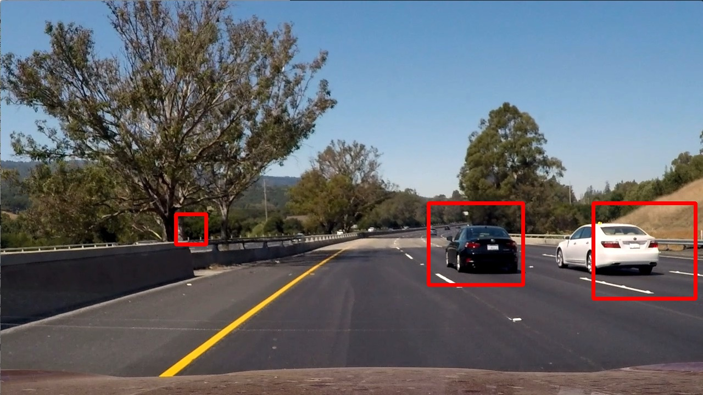
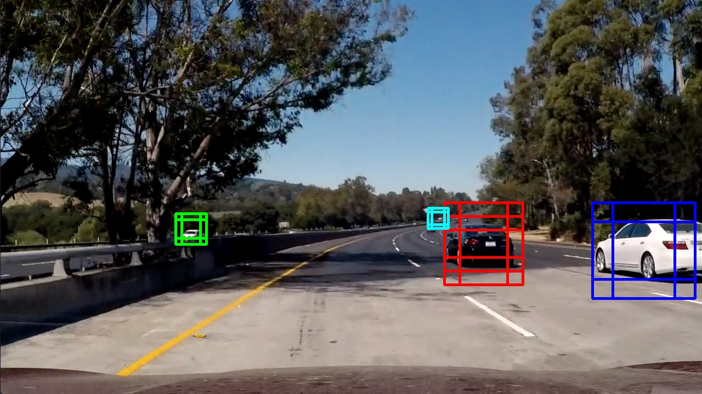
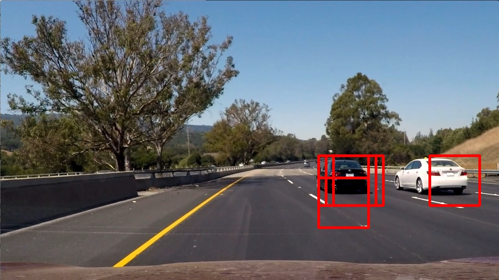

# Vehicle-Detection-and-Tracking
### Udacity Self-Driving Car Engineer Nanodegree. Project: Vehicle Detection and Tracking

This Project is the fifth task (Term-1 : last project) of the Udacity Self-Driving Car Nanodegree program. The main goal of the project is to create 
a software pipeline to identify vehicles in a video from a front-facing camera on a car. Additionally, an [Advanced Lane Line](https://github.com/RajeevSharma2015/Udacity-SelfDrivingCar/new/master/P5-Term1-VehicleDetection) 
finding algorithm was added from the fourth task of the Nanodegree program.

**Result:** [video](https://drive.google.com/file/d/1JsZYJqyH0e55xl2ncq6T4AXdr0qblPxv/view?usp=sharing)

For details on this and other projects, see my [website](https://github.com/rajeevsharma2015)

Visualisation examples of find car process outcome for different images.  

## Content of this project folder [in repository]

- `vehicleDetection_main.py` - Python program for vehicle detection module framework implementation
- `laneline.py` - python program for lane line detection from project-4
- `global_declarations.py` - python file for decleration of global variables for vehicle detection module
- `lesson_functions.py' - python file to define standard functions, class/method and system variable for vehicle detection module
- `test_images` - a directory with test images
- `camera_cal` - a directory with camera calibration images from the project-4
- `svc_pickle.p' - an input data file for SVC classifier training and testing [curriculam test data]
- `/output_images/` - a folder for result images and video's
- `project_video.mp4` - the original raw video from [Udacity](https://github.com/udacity/CarND-Vehicle-Detection)
- `/output_images/processed_video` - vehicle detection module execution [output video's] (https://github.com/RajeevSharma2015/Udacity-SelfDrivingCar/tree/master/P5-Term1-VehicleDetection/output_images/processed_video)

**Note:** The repository does not contain any training images. You have to download and unzip the image datasets of vehicles and 
non-vehicles provided by Udacity and place them in appropriate directories on your own.

Please, refer data loading section in vehicleDetection_main.py which articulate folder structure for training data's, output files and other system parameters.

## Classifier

Features are needed to train a classifier and make predictions on the test or real-world images.

The project required to build a classifier that is able to answer if there is a car in a given image (subset of the whole image).
To address this task three types of features were used: HOG (Histogram of Oriented Gradients) (shape features), binned color 
(color and shape features) and color histogram features (color only features). This combination of features can provide enough 
information for image classification.

Firstly, an automated approach was applied to tune the HOG parameters (`orientations, pixels_per_cell, cells_per_block`). vehicleDetection_main.py
having a section for classifier implementation which doesn't give good result than parameters get tunned and details are available in 
global_declarations.py and lesson_functions.py. 

## Sliding Window and the classifier testing

Basic sliding window algoritm was implemented in the same way to one presented in Udacity's lectures (See the code chunks under 
*Slide window* header). It allows to search a car in a desired region of the frame with a desired window size (each subsamled 
window is rescaled to 64x64 px before classifing by the SVC).

The window size and overlap should be wisely selected. Size of the window should be compared to the size of an expected car. 
These parameters were set to mimic perspective.

There are some sample results for a fixed window size (128x128 px) and overlap for the provided test images:

