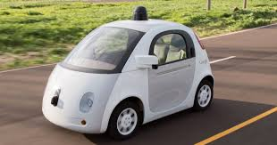
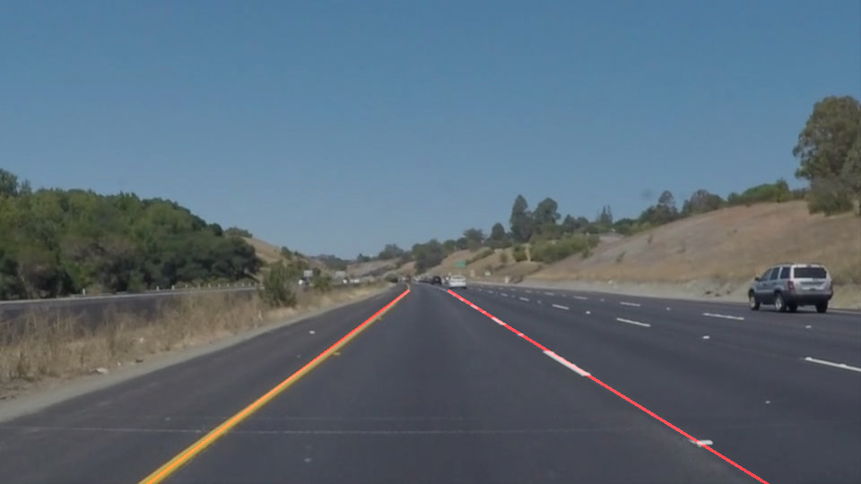
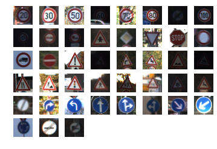
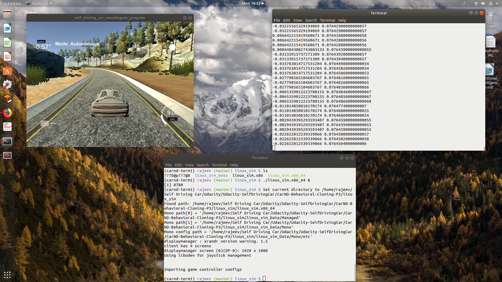
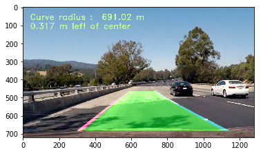
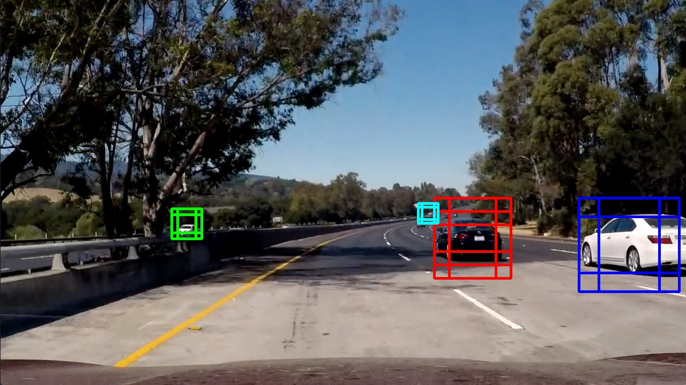

# **Udacity - SelfDrivingCar** 

Udacity Self Driving Car - Nano degree program supposed to complete 14 project assignments. This repository maintain different project work activity, code, input data, outcome/result, writeup for submissions and domains miscellenous learning. Advance nano degree program for self driving car has 3 terms (3 months each). 

#### CURRENT STATUS OF MY COURSE : Term-1 supposed to complete by FEB 2018

## About Program & Core Curriculum
Degree program has three parts (3 terms and 3 months each). here is details of 

## Udacity "Self Driving Car" Program - Learning & Project Works Description 
### Part 1 : Computer Vision and Deep Learning

In this term, you'll become an expert in applying Computer Vision and Deep Learning on automotive problems. You will teach the car to detect lane lines, predict steering angle, and more all based on just camera data!

    Project: Finding Lane Lines on the Road
    Project: Traffic Sign Classifier
    Project: Behavioral Cloning
    Project: Advanced Lane Finding
    Project: Vehicle Detection and Tracking
    
#### Project Result - outcome example 
Just to highlight ojective of project sampled outcome files are demonstrated here, a detailed readme file is also available in sub project folders (each task objective ando program setup) in this repository. 

#### Finding Lane Lines on the Road - Solid Yellow Curve Lines
A depiction of identification of lanes lines marking in a sampled image file. Also visualized same by marking through RED colour lines.

#### Traffic Sign Classifier - German Data Recognition
visualisation of a few sampled data used in learning of neural networks for recognition of test data's.

    
#### Behavioral Cloning - Convolution Neural Network (CNN) for drive learning
Depicted here how through a simulator drive data for neural network learning collected. 

#### Advanced Lane Finding
Applied advance techniques of images processing to identify multi-colour lines, sections of lanes marked on roads efficiently. One outcome depicted herein as a sample outline lane identification, road turn radius and relative position. 

#### Vehicle Detection and Tracking
HOG features analysis, SVM classifier, heat map analysis for vehicle and non-vehicles done to identify roadside object and their position. Also same have been integrated with lane identification outcome of previous project. Sample image depicts a frame analysis wherein cars identified and labelled with boxes.      

##### Video Outcomes of Part 1 projects
(1) Finding Lane Lines on the Road - [Watch the video](https://drive.google.com/file/d/1ZOZOMMk7u63JD6jU6fZaq2dH-KzjeCxP/view?usp=sharing)

(2) Behavioral Cloning - CNN Drive Learning - [Watch the video](https://drive.google.com/file/d/1MJrt0l8EXn4ZZpXhuX_PjlNrsRMan8F1/view?usp=sharing)

(3) Advanced Lane Finding - [Watch the video](https://drive.google.com/file/d/1J40ZrYRKnwvd27SMxqJ7Ba577T7TLLNG/view?usp=sharing)

(4) Vehicle Detection and Tracking - [Watch the video](https://drive.google.com/file/d/1JsZYJqyH0e55xl2ncq6T4AXdr0qblPxv/view?usp=sharing)

### Part 2 : Sensor Fusion, Localization, and Control

In this term, you'll learn how to use an array of sensor data to perceive the environment and control the vehicle. You'll evaluate sensor data from camera, radar, lidar, and GPS, and use these in closed-loop controllers that actuate the vehicle.

    Project: Extended Kalman Filters
    Project: Unscented Kalman Filters
    Project: Kidnapped Vehicle
    Project: PID Controller
    Project: Model Predictive Control

### Part 3 : Path Planning, Concentrations, and Systems

In this term, you'll learn how to plan where the vehicle should go, how the vehicle systems work together to get it there, and you'll perform a deep-dive into a concentration of your choice.

    Project: Path Planning Project
    Project: Semantic Segmentation
    Project: Functional Safety of a Lane Assistance System
    Project: Programming a Real Self-Driving Car

### Term-1 : Projects Sample Outcome Samples
This term was dedicated to "Computer Vision & Deep Learning". We learn finding lane lines on the road, classify traffic signs, driving behaviour cloning, advance lane finding, vehicle detection and tracking.

To achieve pre-decided goals of each project we need to deep dive into advance OpenCV images processing, Neural networks, Machine learning libraries and Deep neural networks. To explore further pl refer each project README & submission WRITEUP file. Few sampled outcomes are represented here !

